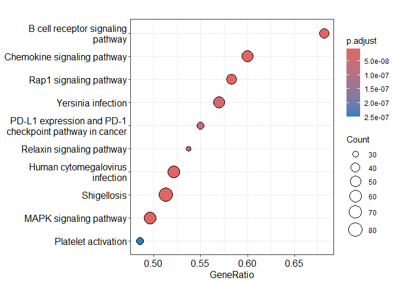
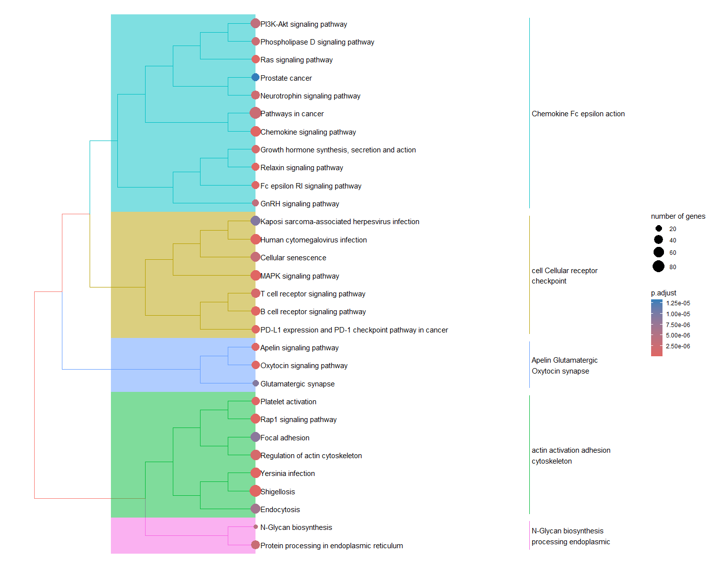

``` r
# install.packages("BiocManager")
# BiocManager::install("clusterProfiler")
# BiocManager::install("org.Hs.eg.db")
```


``` r
library(clusterProfiler)
```

```
## 
```

```
## clusterProfiler v4.16.0 Learn more at https://yulab-smu.top/contribution-knowledge-mining/
## 
## Please cite:
## 
## S Xu, E Hu, Y Cai, Z Xie, X Luo, L Zhan, W Tang, Q Wang, B Liu, R Wang,
## W Xie, T Wu, L Xie, G Yu. Using clusterProfiler to characterize
## multiomics data. Nature Protocols. 2024, 19(11):3292-3320
```

```
## 
## Attaching package: 'clusterProfiler'
```

```
## The following object is masked from 'package:stats':
## 
##     filter
```

We will look for KEGG ([Kyoto Encyclopedia of Genes and Genomes](http://kegg.jp/)) pathways that are significantly enriched in our differential expression results, using the Bioconductor package clusterProfiler [1]. This pathway enrichment package implements a variation of the algorithm of Subramanian et al. developed for GSEA [2,3].  

1. T Wu, E Hu, S Xu, M Chen, P Guo, Z Dai, T Feng, L Zhou, W Tang, L Zhan, X Fu, S Liu, X Bo, and G Yu. clusterProfiler 4.0: A universal enrichment tool for interpreting omics data. The Innovation. 2021, 2(3):100141

2. Subramanian, Aravind, Pablo Tamayo, Vamsi K. Mootha, Sayan Mukherjee, Benjamin L. Ebert, Michael A. Gillette, Amanda Paulovich et al. "Gene set enrichment analysis: a knowledge-based approach for interpreting genome-wide expression profiles." Proceedings of the National Academy of Sciences 102, no. 43 (2005): 15545-15550.

3. G. Korotkevich, V. Sukhov, A. Sergushichev. Fast gene set enrichment
  analysis. bioRxiv (2019), doi:10.1101/060012

### Setting up input gene list
As input to the enrichment analysis, we will use the t statistics (log fold changes divided by their standard errors) from the differential expression analysis.

Read in DE results

``` r
DE.results <- read.delim("DE_results.txt")
```

Create vector of t statistics, where the names are uniprot IDs

``` r
geneList <- DE.results$t
names(geneList) <- DE.results$Protein.Group
geneList <- sort(geneList, decreasing = TRUE)
```

### Run enrichment analysis

``` r
gse <- gseKEGG(gene = geneList, organism = "hsa", keyType = "uniprot", seed = TRUE)
```

```
## Reading KEGG annotation online: "https://rest.kegg.jp/link/hsa/pathway"...
```

```
## Reading KEGG annotation online: "https://rest.kegg.jp/list/pathway/hsa"...
```

```
## Reading KEGG annotation online: "https://rest.kegg.jp/conv/uniprot/hsa"...
```

```
## using 'fgsea' for GSEA analysis, please cite Korotkevich et al (2019).
```

```
## preparing geneSet collections...
```

```
## GSEA analysis...
```

```
## leading edge analysis...
```

```
## done...
```

``` r
tab <- as.data.frame(gse)
knitr::kable(head(tab, 25), row.names = FALSE)
```


|ID       |Description                                            | setSize| enrichmentScore|       NES| pvalue| p.adjust|  qvalue| rank|leading_edge                   |core_enrichment                                                                                                                                                                                                                                                                                                                                                                                                                                                                                                                                                                        |
|:--------|:------------------------------------------------------|-------:|---------------:|---------:|------:|--------:|-------:|----:|:------------------------------|:--------------------------------------------------------------------------------------------------------------------------------------------------------------------------------------------------------------------------------------------------------------------------------------------------------------------------------------------------------------------------------------------------------------------------------------------------------------------------------------------------------------------------------------------------------------------------------------|
|hsa04662 |B cell receptor signaling pathway                      |      66|       0.6480356|  2.747188|  0e+00|  0.0e+00| 0.0e+00| 1651|tags=68%, list=23%, signal=53% |Q8NDB2/Q07889/P48454/P04049/Q08209/Q04206/P07948/P63098/P15498/P16298/P60033/Q92835/P19838/Q9UN19/Q13469/P01111/Q02750/P05412/P16885/O95644/P29350/P27986/P28482/P43405/P36507/P20023/Q6ZUJ8/O15111/Q15653/O00459/P31751/Q9Y6K9/P42336/Q9BXL7/P20273/P15391/O00329/P11912/P01116/P62993/P49841/Q12968/P15153/Q9UKW4/Q07890                                                                                                                                                                                                                                                             |
|hsa04015 |Rap1 signaling pathway                                 |      84|       0.5831962|  2.590209|  0e+00|  0.0e+00| 0.0e+00| 1644|tags=58%, list=23%, signal=45% |Q7LDG7/Q96FS4/Q9BZL6/Q7Z5R6/O43166/P07737/O60292/P04049/Q13905/Q8TEU7/P15498/P11234/P01111/Q02750/P11215/P08514/P04899/P60709/P05106/Q00722/P27986/P46734/P61224/P28482/Q9Y490/P07996/P36507/O00459/Q8WWW0/P31751/P10301/P42336/O94806/O43561/P09471/Q9Y4G6/O00329/P05107/P52564/P01116/P08754/O15117/P19174/P46109/P15056/P15153/O00522/Q9H1C0/Q9UKW4                                                                                                                                                                                                                                 |
|hsa04062 |Chemokine signaling pathway                            |      95|       0.5561499|  2.519823|  0e+00|  0.0e+00| 0.0e+00| 1660|tags=60%, list=24%, signal=46% |P25098/Q7LDG7/Q07889/P04049/Q04206/P07948/P15498/P42768/P19838/P40763/P01111/P59768/Q02750/P17612/P04899/P50151/Q05655/P08631/O75116/P16885/Q14289/Q00722/P27986/P49840/P43250/Q8TCU6/P61224/P28482/O15111/Q15653/O00459/P31751/P02776/Q9Y6K9/Q05397/P42336/P32121/P62879/P32302/P49682/P02775/P48736/O00329/P01116/P08754/P62993/P19174/P49841/P46109/P15056/P35626/P15153/O60674/Q9UKW4/Q07890/P16520/Q92556                                                                                                                                                                         |
|hsa05131 |Shigellosis                                            |     156|       0.4852451|  2.405254|  0e+00|  0.0e+00| 0.0e+00| 1871|tags=51%, list=27%, signal=39% |Q7Z6L1/O75582/Q9H1Y0/P07737/P62330/Q04206/P19838/Q5TEC6/O60610/Q8N122/P42345/P59998/Q13404/Q05655/P60709/P29466/Q96RU3/P24844/P05412/O75116/P16885/P12814/Q00722/Q08752/P27986/P49840/P28482/P52789/Q9Y490/Q9P1U1/O15111/Q14653/Q9UIA0/Q15653/Q15025/O00459/P31751/Q02156/Q9Y6K9/O43353/Q05397/P42336/P61158/O15511/Q8N884/Q13185/O15143/Q14573/O43707/O43318/Q9Y4P8/P45984/P49662/P10415/Q9Y4G6/Q13418/O00329/Q9NYJ8/Q9HB90/Q86WV6/P18206/P19174/Q9H0F6/P49841/P46109/Q13546/Q96JJ3/Q12933/Q14571/Q92556/P07384/Q14141/Q9NPP4/P62979/Q13315/Q8NEB9/P62877/Q9ULZ3/Q13464/P61160        |
|hsa05163 |Human cytomegalovirus infection                        |     117|       0.5048232|  2.380291|  0e+00|  0.0e+00| 0.0e+00| 1659|tags=52%, list=24%, signal=41% |Q14344/Q07889/P23458/Q12802/P48454/P04049/Q08209/Q04206/P63098/Q92888/Q92574/P16298/P19838/Q13469/P40763/P01111/P59768/Q02750/Q15382/P17612/P49815/P42345/P04899/P50151/P05106/O75116/Q14289/Q00722/O95644/P27986/P28482/P36507/O15111/Q14653/O00459/P31751/Q9Y6K9/Q05397/P42336/P62879/Q8N884/P06400/Q14573/P09471/O00329/P52564/P01116/P08754/P16220/P62993/Q86WV6/P49841/Q12968/P46109/Q13546/Q12933/P15153/Q14571/Q07890/P16520/P08047                                                                                                                                             |
|hsa04010 |MAPK signaling pathway                                 |     121|       0.5019789|  2.371640|  0e+00|  0.0e+00| 0.0e+00| 1592|tags=50%, list=23%, signal=39% |O75582/Q7LDG7/Q92918/O14733/Q07889/P48454/P04049/Q08209/Q15283/Q04206/P63098/P16298/P19838/Q9Y2U5/P01111/Q99759/Q02750/P62070/P17612/Q06413/P05412/O95644/Q9Y6R4/P46734/Q9UER7/P61224/P28482/Q12851/P36507/O15111/Q9H2K8/P51812/P31751/Q7L7X3/P10301/Q9Y6K9/O95819/P32121/P45985/P10398/O75676/Q8IW41/P21333/O43318/O75688/P51452/P45984/P53041/Q00653/Q9NYJ8/P52564/Q9BQ95/P01116/P62993/P17535/Q12968/P46109/Q12933/P15056/P15153                                                                                                                                                    |
|hsa04926 |Relaxin signaling pathway                              |      54|       0.6399102|  2.576007|  0e+00|  0.0e+00| 0.0e+00| 1351|tags=54%, list=19%, signal=44% |O14733/Q07889/P04049/Q04206/P19838/P01111/P59768/Q02750/P17612/P04899/P50151/P05412/Q00722/P27986/P28482/P36507/O00459/P31751/P42336/P32121/P62879/P45985/P09471/P45984/O00329/P01116/P08754/P16220/P62993                                                                                                                                                                                                                                                                                                                                                                             |
|hsa05135 |Yersinia infection                                     |     100|       0.5239483|  2.417175|  0e+00|  0.0e+00| 0.0e+00| 1660|tags=57%, list=24%, signal=44% |O14733/P62330/Q04206/Q92888/O43516/P15498/P42768/P19838/Q13469/P01730/Q02750/P59998/P60709/Q14161/P29466/P05412/O75116/Q14289/O95644/P27986/P46734/P84095/P28482/P36507/Q9P1U1/P06239/O15111/Q14653/O00459/P51812/P31751/Q9Y6K9/Q05397/P42336/P45985/P61158/O15511/O60331/O15143/Q16512/O43561/O43318/P45984/O00329/Q9NYJ8/P52564/O15117/P19174/P49841/Q12968/P46109/Q96JJ3/Q12933/Q16513/P15153/Q9UKW4/Q92556                                                                                                                                                                         |
|hsa05235 |PD-L1 expression and PD-1 checkpoint pathway in cancer |      60|       0.6109269|  2.508467|  0e+00|  1.0e-07| 0.0e+00|  925|tags=55%, list=13%, signal=48% |P23458/P48454/P04049/Q08209/Q04206/P63098/P16298/P19838/Q13469/P40763/P01111/Q99759/P01730/Q02750/P42345/Q9NR96/P05412/O95644/P29350/P27986/P46734/Q9HC35/P28482/P36507/P06239/O15111/Q15653/O00459/P31751/Q9Y6K9/P04234/P42336/P07766                                                                                                                                                                                                                                                                                                                                                 |
|hsa04611 |Platelet activation                                    |      68|       0.5726454|  2.448720|  0e+00|  3.0e-07| 1.0e-07| 1211|tags=49%, list=17%, signal=41% |Q14344/Q7LDG7/Q7Z5R6/P07948/Q92888/Q86UX7/P17612/P08514/O00161/P04899/P60709/P07359/P05106/O75116/P16885/Q00722/P27986/P02675/P61224/P28482/Q9Y490/P43405/O00459/P02679/P31751/P36873/P02671/P42336/Q14573/O14974/Q9Y4G6/P48736/O00329                                                                                                                                                                                                                                                                                                                                                 |
|hsa04921 |Oxytocin signaling pathway                             |      58|       0.5983998|  2.435148|  0e+00|  3.0e-07| 1.0e-07| 1637|tags=59%, list=23%, signal=45% |P48454/P04049/Q08209/P63098/P16298/Q9BZL4/Q8IU85/Q13469/P01111/Q02750/P17612/P60660/P04899/Q06413/P60709/P24844/P05412/O75116/Q00722/O95644/P28482/P36507/P36873/Q14573/P09471/O14974/P48736/Q13131/P01116/P08754/P62136/Q12968/Q14571/P54619                                                                                                                                                                                                                                                                                                                                          |
|hsa04371 |Apelin signaling pathway                               |      58|       0.5967455|  2.428416|  0e+00|  3.0e-07| 1.0e-07| 1334|tags=50%, list=19%, signal=41% |Q14344/Q9Y5W3/Q05469/P04049/P01111/P59768/Q02750/P62070/P17612/P42345/P04899/P50151/Q06413/Q02078/Q00722/P28482/P36507/P31751/Q02156/P10301/P62879/P62753/Q14573/P84022/P48736/Q13131/Q9UQL6/P01116/P08754                                                                                                                                                                                                                                                                                                                                                                             |
|hsa04014 |Ras signaling pathway                                  |      91|       0.5091061|  2.308803|  0e+00|  3.0e-07| 1.0e-07|  868|tags=38%, list=12%, signal=34% |Q7LDG7/Q07889/P62330/P04049/Q15283/Q9UQ13/Q04206/P11234/P19838/P14921/P01111/P59768/Q02750/P62070/P17612/P00519/Q14644/P50151/Q86YV0/P16885/O15211/P27986/P61224/P28482/P36507/O15111/O00459/Q8WWW0/Q96KP1/P31751/P10301/Q9Y6K9/P42336/P62879/Q15311                                                                                                                                                                                                                                                                                                                                   |
|hsa04664 |Fc epsilon RI signaling pathway                        |      45|       0.6356731|  2.466239|  0e+00|  4.0e-07| 2.0e-07| 1651|tags=64%, list=23%, signal=50% |O14733/Q07889/P04049/P07948/P15498/Q92835/P01111/Q02750/P16885/P27986/P46734/P28482/P43405/P36507/O00459/P31751/P42336/P45985/O43561/P45984/P20292/O00329/P52564/P01116/P62993/P19174/P15153/Q9UKW4/Q07890                                                                                                                                                                                                                                                                                                                                                                             |
|hsa04935 |Growth hormone synthesis, secretion and action         |      58|       0.5761245|  2.344500|  1e-07|  1.3e-06| 6.0e-07| 1651|tags=60%, list=23%, signal=47% |Q07889/P04049/P40763/P01111/Q02750/P17612/P42345/P04899/P16885/Q00722/P27986/P46734/P28482/P36507/Q92793/O00459/P31751/Q05397/P42336/P45985/P17275/Q14573/P45984/O00329/P52564/P01116/P08754/P16220/P62993/P19174/P49841/P46109/Q14571/O60674/Q07890                                                                                                                                                                                                                                                                                                                                   |
|hsa04660 |T cell receptor signaling pathway                      |      85|       0.5145020|  2.288064|  1e-07|  1.3e-06| 6.0e-07| 1481|tags=55%, list=21%, signal=44% |O14733/Q07889/P48454/P04049/Q08209/Q04206/P63098/P15498/P16298/P19838/Q13469/P01111/P08575/P01730/P16333/Q02750/P05412/O95644/P29350/P27986/P28482/P36507/P06239/Q16537/O15111/Q15653/O00459/O43639/P31751/Q9Y6K9/P04234/P42336/Q9BXL7/P07766/O43561/O43318/P45984/Q15172/O75791/O00329/P67775/P01116/P62993/P19174/Q15173/P49841/Q12968                                                                                                                                                                                                                                               |
|hsa04810 |Regulation of actin cytoskeleton                       |     118|       0.4580122|  2.159638|  1e-07|  1.3e-06| 6.0e-07| 1651|tags=51%, list=23%, signal=40% |Q14344/Q07889/P07737/P04049/P48426/Q92888/Q13576/P15498/Q15052/Q9BZL4/P35579/P01111/Q02750/P62070/P11215/O60610/P08514/P59998/P60709/P05106/P24844/O75116/P12814/Q9H0Q0/P27986/P28482/P06396/Q5JSP0/P36507/Q9P1U1/O00459/P31751/P36873/P10301/Q05397/P42336/P61158/O15511/P10398/O60331/O15143/O43707/P23229/O14974/P26038/P23528/Q8WYL5/O00329/P05107/P01116/Q9NUQ9/P18206/P62136/P78356/P46109/P15056/P15153/Q9H1C0/Q9UKW4/Q07890                                                                                                                                                    |
|hsa04722 |Neurotrophin signaling pathway                         |      73|       0.5375211|  2.316464|  1e-07|  2.2e-06| 1.0e-06| 1552|tags=49%, list=22%, signal=39% |O75582/O14733/Q07889/P04049/Q13905/Q04206/P52566/P19838/P01111/Q99759/Q02750/P00519/Q05655/O14492/P05412/P16885/P27986/P61224/P28482/P36507/Q15653/O00459/P51812/P31751/P52565/O43353/P42336/P45984/P10415/O00329/P01116/P62993/P19174/P49841/P46109/P15056                                                                                                                                                                                                                                                                                                                            |
|hsa04072 |Phospholipase D signaling pathway                      |      62|       0.5537948|  2.290068|  2e-07|  2.6e-06| 1.2e-06| 1408|tags=53%, list=20%, signal=43% |Q14344/Q07889/P62330/P04049/Q92574/P11234/P01111/Q02750/Q15382/P62070/P49815/P42345/P16885/Q14289/Q00722/P27986/P28482/P43405/P36507/Q9UIA0/O00459/P31751/P10301/P42336/P52824/O60331/Q9UQ16/P48736/O00329/P23743/P01116/P62993/P19174                                                                                                                                                                                                                                                                                                                                                 |
|hsa05200 |Pathways in cancer                                     |     201|       0.3809319|  1.957423|  2e-07|  2.6e-06| 1.2e-06| 1659|tags=40%, list=24%, signal=32% |Q14344/O75582/Q7LDG7/Q07889/P23458/P04049/Q04206/Q92888/P11234/P19838/O14727/P14921/P40763/P01111/P59768/Q02750/P17612/P00519/O43521/P08514/P42345/P04899/P50151/P98170/P05412/P24941/O75116/P16885/Q00722/P46527/P27986/Q9HC35/P24043/P28482/Q01196/O14880/Q15788/P40337/P36507/O15111/P09601/Q92793/O00459/Q8WWW0/P31751/Q9Y6K9/Q05397/P42336/P62879/Q15311/P11166/P06753/P10398/P06400/P84022/P10620/Q13105/P45984/P23229/P10415/Q00653/O00329/P56545/P27540/P01116/P08754/P78417/Q13489/P62993/Q92769/P19174/P49841/P46109/Q12933/P15056/P15153/Q9H1C0/O60674/Q07890/P16520/P08047 |
|hsa04141 |Protein processing in endoplasmic reticulum            |     118|      -0.4688716| -2.151616|  2e-07|  2.8e-06| 1.3e-06| 1369|tags=35%, list=19%, signal=28% |P60604/P49257/P27824/P08238/Q86TM6/Q9NYU2/Q9UBS4/Q13217/Q8N2K1/P30040/Q13724/Q99442/P13667/Q92611/Q14697/Q9UKM7/Q9NRD1/Q9UBV2/Q92890/P11021/Q8TAT6/Q12907/Q92575/O94855/P53992/Q9H0U3/Q15436/Q15084/P14625/P30101/Q8TCJ2/P04844/Q9HCU5/Q96DZ1/O94979/P51571/P04843/P46977/P39656/Q9Y4L1/Q9P2E9                                                                                                                                                                                                                                                                                         |
|hsa04218 |Cellular senescence                                    |      90|       0.4879101|  2.205504|  2e-07|  3.1e-06| 1.5e-06| 1795|tags=57%, list=25%, signal=43% |P48454/P04049/Q08209/Q04206/P63098/Q92574/P16298/P19838/Q13469/P14921/P01111/Q02750/Q15382/P62070/O60934/P49815/P42345/Q6MZP7/P24941/O95644/Q08752/P27986/P46734/P28482/P36507/O00459/Q8WWW0/P31751/P36873/P10301/P42336/P49959/Q96EB6/P06400/O60671/Q14573/P84022/O00329/P52564/P01116/P62136/Q12968/Q16254/O96017/Q14571/Q92878/P07384/O60921/Q09028/P01137/Q13315                                                                                                                                                                                                                   |
|hsa04151 |PI3K-Akt signaling pathway                             |     126|       0.4402091|  2.084492|  3e-07|  3.8e-06| 1.8e-06| 1351|tags=42%, list=19%, signal=35% |Q07889/P23458/P04049/Q04206/Q92574/P19838/P01111/P59768/Q02750/Q15382/P49815/P31946/O43521/P08514/Q8N122/P42345/P50151/P05106/Q96BR1/P24941/P46527/P27986/P24043/P28482/P07996/P43405/P36507/Q6ZUJ8/Q16537/O15111/P23588/O00459/P31751/Q9Y6K9/P63104/Q05397/P42336/P62879/P62753/Q16512/P15391/P23229/P10415/Q15172/P48736/O00329/P67775/P27348/Q13131/P61981/P01116/P16220/P62993                                                                                                                                                                                                     |
|hsa04912 |GnRH signaling pathway                                 |      41|       0.6351122|  2.407716|  3e-07|  3.8e-06| 1.8e-06| 1351|tags=54%, list=19%, signal=44% |O14733/Q07889/P04049/Q9Y2U5/P01111/Q99759/Q02750/P17612/Q05655/P05412/Q14289/Q00722/Q9Y6R4/P46734/P28482/P36507/P45985/Q14573/P45984/P52564/P01116/P62993                                                                                                                                                                                                                                                                                                                                                                                                                              |
|hsa00510 |N-Glycan biosynthesis                                  |      35|      -0.6568582| -2.296012|  4e-07|  4.5e-06| 2.1e-06| 1003|tags=43%, list=14%, signal=37% |Q9NP73/Q13724/Q14697/Q9UKM7/P15907/Q10469/Q9BT22/Q9H0U3/Q8TCJ2/P04844/P04843/P46977/P39656/Q16706/P26572                                                                                                                                                                                                                                                                                                                                                                                                                                                                               |
  

### Interpreting the results

Gene set enrichment analysis output includes the following columns:

* setSize: Number of genes in pathway

* enrichmentScore: [GSEA enrichment score](https://www.gsea-msigdb.org/gsea/doc/GSEAUserGuideTEXT.htm#_Enrichment_Score_(ES)), a statistic reflecting the degree to which a pathway is overrepresented at the top or bottom of the gene list (the gene list here consists of the t-statistics from the DE test).

* NES: [Normalized enrichment score](https://www.gsea-msigdb.org/gsea/doc/GSEAUserGuideTEXT.htm#_Normalized_Enrichment_Score)

* pvalue: Raw p-value from permutation test of enrichment score

* p.adjust: Benjamini-Hochberg false discovery rate adjusted p-value

* qvalue: Storey false discovery rate adjusted p-value 

* rank: Position in ranked list at which maximum enrichment score occurred

* leading_edge: [Statistics from leading edge analysis](https://www.gsea-msigdb.org/gsea/doc/GSEAUserGuideTEXT.htm#_Detailed_Enrichment_Results)

Based on the sign of the normalized enrichment score, the pathway "B cell receptor signaling pathway" is positively enriched and the pathway "Protein processing in endoplasmic reticulum" is negatively enriched.  

This means that the B cell receptor signaling pathway is enriched among proteins with large positive t-statistics (that are higher in mutated subjects).  The pathway Protein processing in endoplasmic reticulum is enriched among proteins with large negative t-statistics (that are lower in mutated subjects).

### Plots

#### Dotplot of top terms

``` r
dotplot(gse)
```

<!-- -->

#### Treeplot of top pathways

Pathways are clustered based on similarity, defined by overlap of which proteins are in that pathway.  Clusters are then labelled with commonly occuring words.


``` r
gse2 <- enrichplot::pairwise_termsim(gse)
enrichplot::treeplot(gse2)
```

<!-- -->

### R session information

``` r
sessionInfo()
```

```
## R version 4.5.1 (2025-06-13 ucrt)
## Platform: x86_64-w64-mingw32/x64
## Running under: Windows 11 x64 (build 26100)
## 
## Matrix products: default
##   LAPACK version 3.12.1
## 
## locale:
## [1] LC_COLLATE=English_United States.utf8 
## [2] LC_CTYPE=English_United States.utf8   
## [3] LC_MONETARY=English_United States.utf8
## [4] LC_NUMERIC=C                          
## [5] LC_TIME=English_United States.utf8    
## 
## time zone: America/Los_Angeles
## tzcode source: internal
## 
## attached base packages:
## [1] stats     graphics  grDevices datasets  utils     methods   base     
## 
## other attached packages:
## [1] clusterProfiler_4.16.0
## 
## loaded via a namespace (and not attached):
##   [1] DBI_1.2.3               gson_0.1.0              rlang_1.1.6            
##   [4] magrittr_2.0.3          DOSE_4.2.0              compiler_4.5.1         
##   [7] RSQLite_2.4.3           png_0.1-8               vctrs_0.6.5            
##  [10] reshape2_1.4.4          stringr_1.5.1           pkgconfig_2.0.3        
##  [13] crayon_1.5.3            fastmap_1.2.0           XVector_0.48.0         
##  [16] labeling_0.4.3          rmarkdown_2.29          enrichplot_1.28.4      
##  [19] UCSC.utils_1.4.0        purrr_1.1.0             bit_4.6.0              
##  [22] xfun_0.53               cachem_1.1.0            aplot_0.2.8            
##  [25] GenomeInfoDb_1.44.2     jsonlite_2.0.0          blob_1.2.4             
##  [28] BiocParallel_1.42.1     parallel_4.5.1          R6_2.6.1               
##  [31] bslib_0.9.0             stringi_1.8.7           RColorBrewer_1.1-3     
##  [34] jquerylib_0.1.4         GOSemSim_2.34.0         Rcpp_1.1.0             
##  [37] knitr_1.50              snow_0.4-4              ggtangle_0.0.7         
##  [40] R.utils_2.13.0          IRanges_2.42.0          Matrix_1.7-3           
##  [43] splines_4.5.1           igraph_2.1.4            tidyselect_1.2.1       
##  [46] qvalue_2.40.0           yaml_2.3.10             codetools_0.2-20       
##  [49] lattice_0.22-7          tibble_3.3.0            plyr_1.8.9             
##  [52] Biobase_2.68.0          treeio_1.32.0           withr_3.0.2            
##  [55] KEGGREST_1.48.1         evaluate_1.0.4          gridGraphics_0.5-1     
##  [58] Biostrings_2.76.0       pillar_1.11.0           BiocManager_1.30.26    
##  [61] ggtree_3.16.3           renv_1.1.5              stats4_4.5.1           
##  [64] ggfun_0.2.0             generics_0.1.4          S4Vectors_0.46.0       
##  [67] ggplot2_3.5.2           scales_1.4.0            tidytree_0.4.6         
##  [70] glue_1.8.0              lazyeval_0.2.2          tools_4.5.1            
##  [73] ggnewscale_0.5.2        data.table_1.17.8       fgsea_1.34.2           
##  [76] fs_1.6.6                fastmatch_1.1-6         cowplot_1.2.0          
##  [79] grid_4.5.1              tidyr_1.3.1             ape_5.8-1              
##  [82] AnnotationDbi_1.70.0    colorspace_2.1-1        nlme_3.1-168           
##  [85] GenomeInfoDbData_1.2.14 patchwork_1.3.2         cli_3.6.5              
##  [88] rappdirs_0.3.3          dplyr_1.1.4             gtable_0.3.6           
##  [91] R.methodsS3_1.8.2       yulab.utils_0.2.1       sass_0.4.10            
##  [94] digest_0.6.37           BiocGenerics_0.54.0     ggrepel_0.9.6          
##  [97] ggplotify_0.1.2         farver_2.1.2            memoise_2.0.1          
## [100] htmltools_0.5.8.1       R.oo_1.27.1             lifecycle_1.0.4        
## [103] httr_1.4.7              GO.db_3.21.0            bit64_4.6.0-1
```
