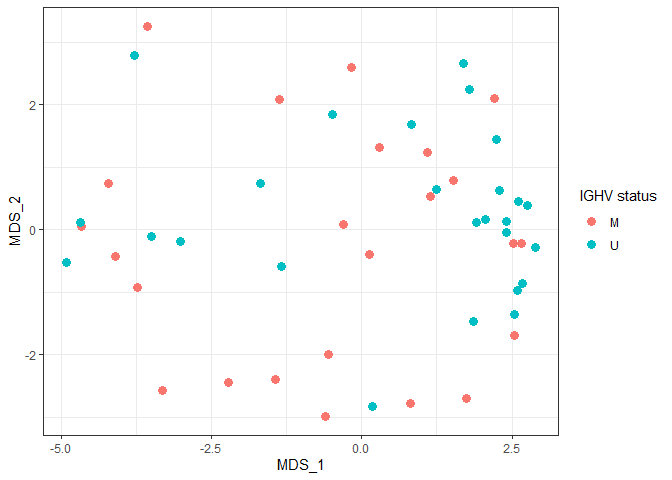

``` r
library(dplyr)
library(limma)
library(ggplot2)
library(ggrepel)
library(ComplexHeatmap)
```

## Introduction

Limma is an R package (developed for use with gene expression microarrays) that is used for differential abundance/expression analysis of proteomics, metabolomics, RNA sequencing, and other 'omics data.

### Core steps of limma analysis

1. A linear model (e.g. ANOVA or regression) is fitted to each protein.

2. Empirical Bayes smoothing is used to get better estimates of standard errors of log fold changes, which are then used in differential abundance testing.

3. P-values are adjusted for multiple testing across proteins using the Benjamini-Hochberg false discovery rate controlling method.

Limma allows for more complicated experimental designs and models than many other packages.

References:

Matthew E. Ritchie, Belinda Phipson, Di Wu, Yifang Hu, Charity W. Law, Wei Shi, Gordon K. Smyth, limma powers differential expression analyses for RNA-sequencing and microarray studies, Nucleic Acids Research, Volume 43, Issue 7, 20 April 2015, Page e47, https://doi.org/10.1093/nar/gkv007

Smyth GK. Linear models and empirical bayes methods for assessing differential expression in microarray experiments. Stat Appl Genet Mol Biol. 2004;3:Article3. doi: 10.2202/1544-6115.1027. Epub 2004 Feb 12. PMID: 16646809.

https://www.bioconductor.org/packages//2.11/bioc/vignettes/limma/inst/doc/usersguide.pdf

### Data

We will use proteomics data from Kistner et al. on 50 subjects with chronic lymphocytic leukemia (CLL).  

The differential abundance analysis will compare subjects with mutated (M) IGHV versus unmutated (U) IGHV.  CLL patients with mutated IGHV tend to have a better prognosis.


References:

Franziska Kistner, Justus L. Grossmann, Ludwig R. Sinn, Vadim Demichev
bioRxiv 2023.06.20.545604; doi: https://doi.org/10.1101/2023.06.20.545604

## Analysis
### Read in proteomics data and metadata

Read in proteomics data, clean up:

``` r
dat0 <- read.delim("legacy-report.pg_matrix.tsv", check.names = FALSE)

# Split out protein annotation and protein abundance data
anno <- select(dat0, Protein.Group:First.Protein.Description)
dat <- select(dat0, -(Protein.Group:First.Protein.Description))

# Clean up column names so they match filenames in metadata
colnames(dat) <- gsub("D:\\PXD022216\\", "", colnames(dat), fixed = TRUE)

# Set rownames to Protein.Group
rownames(dat) <- anno$Protein.Group
```

Read in metadata, reorder so matches order of proteomics data.  *Very important!*


``` r
pdata <- read.delim("Annotation_file_timsTOF.txt")
rownames(pdata) <- pdata$File.name

# Reorder to match proteomics data
pdata <- pdata[colnames(dat),]

# Check again to make sure metadata matches proteomics data
identical(pdata$File.name, colnames(dat))
```

```
## [1] TRUE
```
Set missing values to 0:


``` r
na.mat <- is.na(dat) 
dat[na.mat] <- 0
```

We will log transform the proteomics data prior to analysis.  This helps make the data closer to normally distributed and makes the variability more constant between low and high expressed proteins.

Log transform data:


``` r
dat.trans <- log2(dat + 1)
```

Boxplot of data to evaluate need for between-sample normalization:


``` r
boxplot(dat.trans, xaxt = "n")
```

<!-- -->

Between sample normalization appears to have already been performed.  We could use the limma function normalizeCyclicLoess to normalize if this wasn't the case:

Example of normalization (not run):


``` r
dat.trans <- normalizeCyclicLoess(dat.trans)
```

Next, we filter the data to remove proteins present in few samples.  This helps with the following:

1. Testing fewer proteins makes the multiple testing adjustment less strict (the remaining proteins have a better chance of being significant).

2. Having proteins that are absent (zero) in lots of samples introduces large numbers of ties in the data, causing the variability to be underestimated.

Filter to proteins present in at least half of samples:


``` r
num.nonmissing <- rowSums(!na.mat)
keep <- num.nonmissing >= ncol(dat.trans)/2
dat.filtered <- dat.trans[keep,]
```

### Multidimensional scaling plots

A multidimensional scaling (MDS) plot is a two dimensional view of the data showing the relative distances between protein profiles.  

We will use the limma function plotMDS to get the MDS coordinates then make the actual plot in ggplot2 (https://ggplot2.tidyverse.org/) for extra flexibility.


``` r
coords <- plotMDS(dat.filtered, plot = FALSE)
plotdat <- pdata
plotdat$MDS_1 <- coords$x
plotdat$MDS_2 <- coords$y
```

#### MDS plot by IGHV status

``` r
ggplot(plotdat, aes(x = MDS_1, y = MDS_2, color = IGHV.status)) + geom_point(size = 3) + theme_bw() + labs(color = "IGHV status")
```

<!-- -->

#### MDS plot by gender

``` r
ggplot(plotdat, aes(x = MDS_1, y = MDS_2, color = Gender)) + geom_point(size = 3) + theme_bw()
```

<!-- -->

#### MDS plot by leukocyte count

``` r
ggplot(plotdat, aes(x = MDS_1, y = MDS_2, color = Leukocyte.count)) + geom_point(size = 3) + theme_bw() + scale_color_viridis_c() + labs(color = "Leukocyte count")
```

<!-- -->

### Differential abundance analysis in limma

We will compare expression of each protein between subjects with mutated and unmutated IGHV.

The design matrix is how we specify the experimental design in limma.

Set up design matrix:


``` r
mm <- model.matrix(~0 + IGHV.status, data = pdata)
```

Fit model to each protein:


``` r
fit <- lmFit(dat.filtered, mm)
```

Specify comparison ("contrast") being tested:


``` r
contr <- makeContrasts(IGHV.statusM - IGHV.statusU, levels = colnames(coef(fit)))
contr2 <- contrasts.fit(fit, contrasts = contr)
```

Empirical Bayes smoothing adjusts the standard error of each protein to be closer to the average standard error, compensating for unusually high or low variability proteins.

Empirical Bayes smoothing:


``` r
contr3 <- eBayes(contr2)
```

Finally, we adjust for testing multiple proteins.  With 7043 proteins after filtering, we would expect 352.15 to have a raw p-value less than 0.05, even if there were no true differences.

Defining significant as FDR adjusted P < 0.05 means that we expect 5% of the proteins with an adjusted p-value < 0.05 to be false discoveries.

Display differential abundance results with Benjamini-Hochberg false discovery rate adjusted p-values:


``` r
results <- topTable(contr3, sort.by = "P", n = Inf)
head(results)
```

```
##             logFC   AveExpr         t      P.Value   adj.P.Val        B
## Q5T7N2 -7.0562842  5.342274 -6.087076 1.718323e-07 0.001210215 7.066122
## P02545 -1.5809825 15.231864 -5.554732 1.126951e-06 0.002031282 5.347222
## Q7Z6L1  0.5239282 12.468625  5.445413 1.652756e-06 0.002031282 4.997042
## Q8NDB2  1.2098372 13.587557  5.425782 1.770141e-06 0.002031282 4.934294
## Q13572  0.4398251 12.845232  5.423379 1.785062e-06 0.002031282 4.926617
## Q9Y6C9 -0.4183323 15.632817 -5.393540 1.981094e-06 0.002031282 4.831330
```

Results include the following columns:

* logFC: log2 fold change for IGHV status M - U

* AveExpr: Average protein level across all samples, on transformed scale

* t: t statistic, or log fold change divided by its standard error

* P.Value: Raw p-value from the test that the logFC differs from 0

* adj.P.Val: Benjamini-Hochberg false discovery rate adjusted p-value

* B: log odds of differential abundance


How many proteins differ significantly between mutated and unmutated IGHV status subjects:


``` r
length(which(results$adj.P.Val < 0.05))
```

```
## [1] 178
```

Merge in annotation information:


``` r
results$Protein.Group <- rownames(results)
results <- left_join(results, anno, by = "Protein.Group")
head(results)
```

```
##        logFC   AveExpr         t      P.Value   adj.P.Val        B
## 1 -7.0562842  5.342274 -6.087076 1.718323e-07 0.001210215 7.066122
## 2 -1.5809825 15.231864 -5.554732 1.126951e-06 0.002031282 5.347222
## 3  0.5239282 12.468625  5.445413 1.652756e-06 0.002031282 4.997042
## 4  1.2098372 13.587557  5.425782 1.770141e-06 0.002031282 4.934294
## 5  0.4398251 12.845232  5.423379 1.785062e-06 0.002031282 4.926617
## 6 -0.4183323 15.632817 -5.393540 1.981094e-06 0.002031282 4.831330
##   Protein.Group Protein.Ids Protein.Names  Genes
## 1        Q5T7N2      Q5T7N2   LITD1_HUMAN  L1TD1
## 2        P02545      P02545    LMNA_HUMAN   LMNA
## 3        Q7Z6L1      Q7Z6L1   TCPR1_HUMAN TECPR1
## 4        Q8NDB2      Q8NDB2   BANK1_HUMAN  BANK1
## 5        Q13572      Q13572   ITPK1_HUMAN  ITPK1
## 6        Q9Y6C9      Q9Y6C9   MTCH2_HUMAN  MTCH2
##                             First.Protein.Description
## 1 LINE-1 type transposase domain-containing protein 1
## 2                                        Prelamin-A/C
## 3 Tectonin beta-propeller repeat-containing protein 1
## 4        B-cell scaffold protein with ankyrin repeats
## 5                 Inositol-tetrakisphosphate 1-kinase
## 6                     Mitochondrial carrier homolog 2
```

### Volcano plot of results
A volcano plot shows -log10(p-value) plotted against the log fold change.


``` r
results$isSig <- ifelse(results$adj.P.Val < 0.05, "Significant", "Not Significant")
top.results <- results[1:15,] # we will only label the most significant proteins
ggplot(results, aes(x = logFC, y = -log10(P.Value), col = isSig)) + geom_point() + 
  scale_color_manual(values = c("grey", "blue")) + 
  geom_text_repel(data = top.results, aes(label = Genes), max.overlaps = Inf, color = "black") + 
  theme_bw() + 
  labs(color = NULL)
```

<!-- -->


### Heatmap of top 20 proteins

A heatmap displays the sample-level expression of a set of proteins.

We'll use the R package ComplexHeatmap (https://jokergoo.github.io/ComplexHeatmap-reference/book/)


``` r
toplot <- results$Protein.Group[1:20] 
plotdat <- as.matrix(dat.filtered[toplot,])
new.rownames <- anno$Genes[match(rownames(plotdat), anno$Protein.Group)]

set.seed(99) # Annotation bar colors are random!
col_ha <- HeatmapAnnotation(`IGHV status` = pdata$IGHV.status, annotation_name_side = "left")

Heatmap(plotdat, heatmap_legend_param = list(title = "log2\nNormalized\nAbundance"), show_column_names = FALSE, row_labels = new.rownames, bottom_annotation = col_ha)
```

<!-- -->

Plot using Z scores:


``` r
toplot <- results$Protein.Group[1:20] 
plotdat <- as.matrix(dat.filtered[toplot,])
# convert to Z scores
plotdat <- t(apply(plotdat, 1, scale))

new.rownames <- anno$Genes[match(rownames(plotdat), anno$Protein.Group)]

set.seed(99) # Annotation bar colors are random!
col_ha <- HeatmapAnnotation(`IGHV status` = pdata$IGHV.status, annotation_name_side = "left")

Heatmap(plotdat, heatmap_legend_param = list(title = "Z score"), show_column_names = FALSE, row_labels = new.rownames, bottom_annotation = col_ha)
```

<!-- -->

### Boxplots of individual proteins

``` r
plotdat <- pdata
plotdat$L1TD1 <- as.numeric(dat.filtered["Q5T7N2",])
plotdat$LMNA <- as.numeric(dat.filtered["P02545",])
```


``` r
ggplot(plotdat, aes(x = IGHV.status, y = L1TD1, fill = IGHV.status)) + geom_boxplot() + theme_bw() + theme(legend.position = "none") + labs(x = "IGHV status")
```

<!-- -->


``` r
ggplot(plotdat, aes(x = IGHV.status, y = LMNA, fill = IGHV.status)) + geom_boxplot() + theme_bw() + theme(legend.position = "none") + labs(x = "IGHV status")
```

<!-- -->

### R session information

``` r
sessionInfo()
```

```
## R version 4.4.1 (2024-06-14 ucrt)
## Platform: x86_64-w64-mingw32/x64
## Running under: Windows 11 x64 (build 22631)
## 
## Matrix products: default
## 
## 
## locale:
## [1] LC_COLLATE=English_United States.utf8 
## [2] LC_CTYPE=English_United States.utf8   
## [3] LC_MONETARY=English_United States.utf8
## [4] LC_NUMERIC=C                          
## [5] LC_TIME=English_United States.utf8    
## 
## time zone: America/Los_Angeles
## tzcode source: internal
## 
## attached base packages:
## [1] grid      stats     graphics  grDevices utils     datasets  methods  
## [8] base     
## 
## other attached packages:
## [1] ComplexHeatmap_2.20.0 ggrepel_0.9.5         ggplot2_3.5.1        
## [4] limma_3.60.4          dplyr_1.1.4          
## 
## loaded via a namespace (and not attached):
##  [1] sass_0.4.9          utf8_1.2.4          generics_0.1.3     
##  [4] shape_1.4.6.1       digest_0.6.37       magrittr_2.0.3     
##  [7] RColorBrewer_1.1-3  evaluate_0.24.0     iterators_1.0.14   
## [10] circlize_0.4.16     fastmap_1.2.0       foreach_1.5.2      
## [13] doParallel_1.0.17   jsonlite_1.8.8      GlobalOptions_0.1.2
## [16] fansi_1.0.6         viridisLite_0.4.2   scales_1.3.0       
## [19] codetools_0.2-20    jquerylib_0.1.4     cli_3.6.3          
## [22] rlang_1.1.4         crayon_1.5.3        munsell_0.5.1      
## [25] withr_3.0.1         cachem_1.1.0        yaml_2.3.10        
## [28] tools_4.4.1         parallel_4.4.1      colorspace_2.1-1   
## [31] BiocGenerics_0.50.0 GetoptLong_1.0.5    vctrs_0.6.5        
## [34] R6_2.5.1            png_0.1-8           stats4_4.4.1       
## [37] matrixStats_1.3.0   lifecycle_1.0.4     S4Vectors_0.42.1   
## [40] IRanges_2.38.1      clue_0.3-65         cluster_2.1.6      
## [43] pkgconfig_2.0.3     pillar_1.9.0        bslib_0.8.0        
## [46] gtable_0.3.5        glue_1.7.0          Rcpp_1.0.13        
## [49] statmod_1.5.0       highr_0.11          xfun_0.47          
## [52] tibble_3.2.1        tidyselect_1.2.1    rstudioapi_0.16.0  
## [55] knitr_1.48          farver_2.1.2        rjson_0.2.22       
## [58] htmltools_0.5.8.1   labeling_0.4.3      rmarkdown_2.28     
## [61] compiler_4.4.1
```
